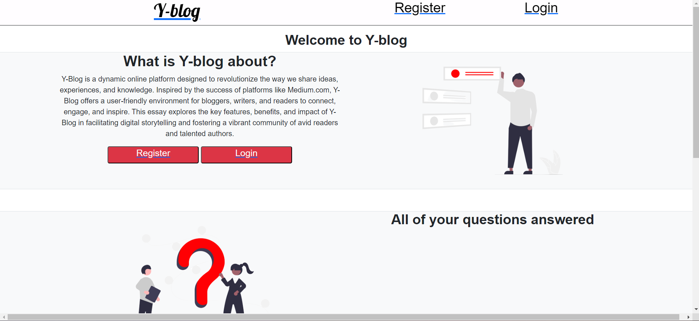
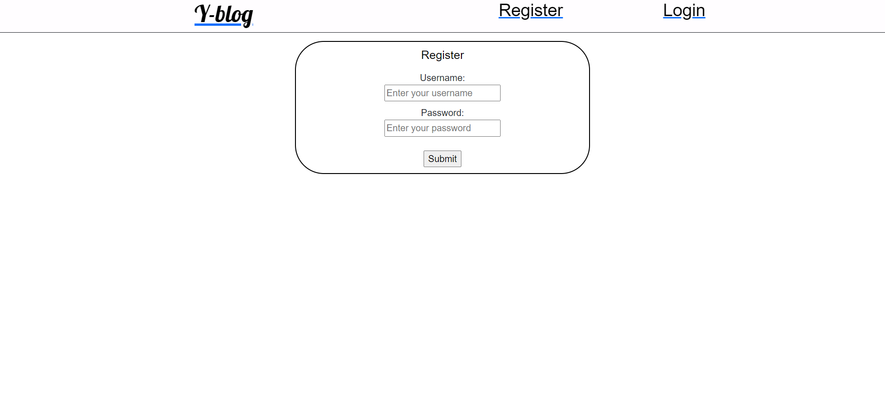
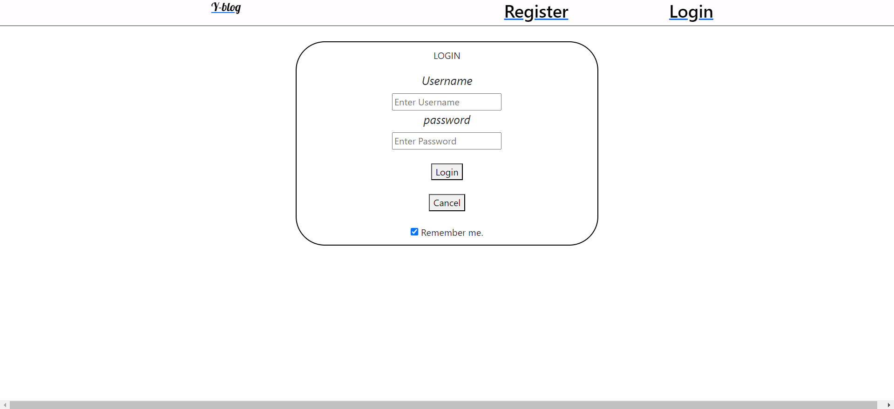

# Y-blog

> What is Y-blog?

Y-Blog is a dynamic online platform designed to revolutionize the way we share ideas, experiences, and knowledge. Inspired by the success of platforms like Medium.com, Y-Blog offers a user-friendly environment for bloggers, writers, and readers to connect, engage, and inspire. This essay explores the key features, benefits, and impact of Y-Blog in facilitating digital storytelling and fostering a vibrant community of avid readers and talented authors.

> Why Y-blog?
* User-friendly interface: Y-Blog offers a simple and intuitive platform that makes blogging accessible to all, regardless of technical expertise.

* Extensive blogging tools: Authors can create captivating content with a wide array of writing and formatting tools at their disposal.

* Multimedia integration: Y-Blog supports the seamless integration of multimedia content, enabling authors to enhance their blogs with images, videos, and more.

> Previews of Y-blog:

> Homepage

> Register Page

> Login Page

> What was used to build Y-blog
* Html
* Css